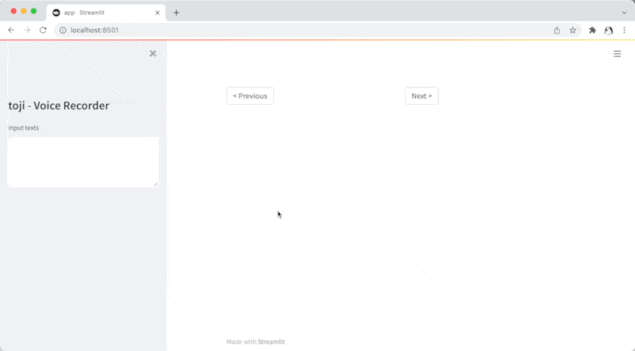

# tohji - 東寺
tohji is standalone web application that collect a lot of speech audio efficiently.



## Usage
### Start-up
You can use docker,

```shell
$ docker build -t tohji .
$ docker run -p 8501:8501 --rm -t -i tohji
```

or start locally.

```shell
$ poetry install
$ poetry run streamlit run tohji/app.py
```

### Use Web App

1. Prepare the speech texts with line breaks and paste it into the text area.
2. Press `START` button to start recording
3. When you have finished speaking, press the `STOP` button
4. Press `Next` to move on to the next utterance.
5. When all tasks are finished, click `Proceed to Download` button to download the wav files.

